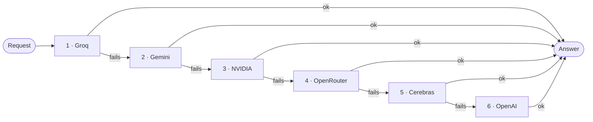
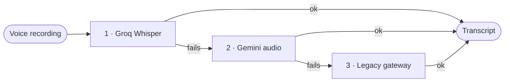
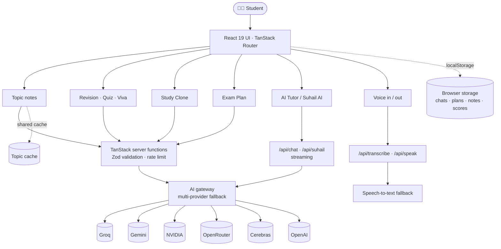

<div align="center">


# 🧠 Suhail Personal AI

### Your entire syllabus. Explained by AI.

**An AI-first study companion for B.Tech CSE (AI & ML) students — Hinglish explanations, exam revision, mock viva, personal notes tutor, and a voice-enabled AI assistant, all in one app.**

[](https://new-study-pilot.vercel.app)


**Learn → Understand → Visualize → Practice → Revise → Ace the exam**

[Features](#-features) · [Screenshots](#-screenshots) · [How the AI works](#-how-the-ai-works) · [Quick start](#-quick-start) · [Deploy](#-deploy-to-vercel) · [Roadmap](#-roadmap)

</div>

---

## 📖 Table of Contents

- [What is Suhail Personal AI?](#-what-is-suhail-personal-ai)
- [Features](#-features)
- [Screenshots](#-screenshots)
- [How the AI works](#-how-the-ai-works)
- [Pages & routes](#-pages--routes)
- [Tech stack](#-tech-stack)
- [Architecture](#-architecture)
- [Project structure](#-project-structure)
- [Quick start](#-quick-start)
- [Environment variables](#-environment-variables)
- [Scripts](#-scripts)
- [Deploy to Vercel](#-deploy-to-vercel)
- [Privacy & security notes](#-privacy--security-notes)
- [Roadmap](#-roadmap)
- [About the developer](#-about-the-developer)

---

## ✨ What is Suhail Personal AI?

Most study sites give you static notes. **Suhail Personal AI gives you a study partner.**

Pick any topic of your syllabus and the AI explains it the way a friendly senior would — first in **Hinglish** so it clicks, then in clear **English**, then in formal textbook style — followed by definitions, diagrams, a comparison table, interview and viva questions and a memory trick. When exams come close, switch to **Smart Revision**, take a **mock viva** out loud with your camera and mic, ask questions from **your own notes**, or let the AI build an **hour-by-hour exam plan**.

> The project started life as **StudyPilot AI** and grew into **Suhail Personal AI**.

| | |
|---|---|
| 🎓 **Built for** | B.Tech CSE (AI & ML), 5th semester |
| 📚 **Syllabus loaded** | 5 subjects · 25 units · 250+ topics |
| 🗣️ **Language flow** | Hinglish first → Easy English → Detailed English |
| 💸 **Cost to use** | Free to browse, no login, no account |

---

## 🚀 Features

### 📚 1. Full Syllabus, Explained by AI

All five subjects with every unit and topic are loaded — **Artificial Intelligence, Machine Learning, Operating System, Internet of Things, Constitution of India**.

Open any topic and the AI generates a complete, exam-ready page in a fixed order:

| # | Section | # | Section |
|---|---|---|---|
| 1 | 🗣️ Hinglish Explanation | 9 | 🧭 Applications |
| 2 | 🌱 Easy Explanation (English) | 10 | 🖼️ Diagram / Flow (ASCII) |
| 3 | 📘 Detailed Explanation (English) | 11 | 📊 Comparison Table |
| 4 | 🌍 Real-World Example | 12 | 🎤 Interview Questions |
| 5 | 📖 Key Definitions | 13 | 🧑‍🏫 Viva Questions |
| 6 | 📌 Key Points | 14 | 🧠 Memory Trick |
| 7 | ✅ Advantages | 15 | ➗ Formula Sheet |
| 8 | ⚠️ Disadvantages / Limitations | 16 | 📝 Exam Summary |

- ⚡ **Shared cache** — once a topic is generated, it opens instantly for everyone.
- 🔁 **Regenerate with AI** any time you want a fresh explanation.
- ⬅️➡️ **Previous / Next topic** navigation to study in syllabus order.

---

### 🎯 2. Smart Revision — `/revision`

Choose a **subject → chapter → time budget** (5 / 15 / 30 / 60 minutes) and get:

- 📝 **Revision sheet** sized to your time: concepts, definitions, important points, frequently asked university questions, expected questions, diagrams and flowcharts, memory tricks, one-line revision notes and common mistakes. Subject-aware extras — algorithms for AI/ML, commands for OS, articles for the Constitution.
- ✅ **10-question practice test** with instant scoring, explanations and **weak-topic detection**.
- 🔮 **AI-predicted exam questions** — trend analysis, high/medium-probability questions with marks and probability, and model answer structures. It uses the **previous-year questions you save in the Admin panel**.
- 📈 **Performance tracking** — minutes revised, chapters covered, accuracy, best score and quizzes taken, saved in your browser.

---

### 🎙️ 3. Mock Viva Simulator

A real oral-exam rehearsal inside `/revision`:

1. The AI **examiner generates 6 viva questions** (easy → hard) for your chapter.
2. It **asks them out loud**; you **answer by speaking** with camera and mic on.
3. Your speech is **transcribed** and evaluated.
4. You get **confidence, knowledge and fluency scores**, a per-question score with feedback, your strengths and what to improve — with an encouraging Hinglish verdict.

Recordings are converted to 16 kHz WAV in your browser and sent through the speech-to-text fallback chain (below). If the examiner's cloud voice is unavailable, your browser's built-in voice takes over.

---

### 🧬 4. Study Clone — `/clone`

Paste (or upload a `.txt` / `.md` file of) **your own notes**, then:

- 💬 **Ask questions** — answers come **strictly from your notes**, in Hinglish **and** English, with the exact lines quoted. If your notes don't cover it, it says so clearly.
- 📦 **One-click revision pack** — quick summary, key definitions, important points, likely exam questions, one-line revision and a list of **gaps** in your notes.

---

### 📅 5. Exam Plan — `/plan`

Enter your exam name, date, daily study hours, subjects and weak topics. You get a **live countdown** and an AI-built plan: **today's hour-by-hour schedule**, a **day-wise roadmap**, priority order, a daily revision ritual, last-48-hours strategy and a motivation line. Your setup is saved locally.

---

### 🤖 6. AI Tutor — `/chat`

A streaming, exam-focused tutor for your syllabus (called **Orbit AI** inside the app):

- Real-time streamed answers in clean Markdown (code, tables, lists)
- Starter suggestions, **voice input** (speech-to-text), multi-line input
- Adds Hinglish explanations when they help

---

### 🌌 7. Suhail AI — `/suhail`

A premium, **anime-inspired AI companion** with personality.

- 🧑‍🎤 **Animated avatar** that reacts live: *idle → listening → thinking → speaking*
- 🌍 **Replies in whatever language you write in** — Hindi, Hinglish, English, anything — and switches instantly if you do
- 🎚️ **7 answer modes**: Normal · Beginner · Class 10 · B.Tech · MCQs · Revision · Notes
- 🔊 **Talk or type** — voice input, spoken replies, mute toggle and **speed control**
- 💬 **Chat history** with search, saved in your browser
- ✨ Quick chips like *"Explain simpler"* and follow-up *"Try next:"* suggestions
- 🫧 A floating **Suhail button** on every other page takes you here in one tap

---

### 🛠️ 8. Admin Panel — `/admin`

A password-gated panel to manage:

- 📄 **PYQ Manager** — previous-year questions (title, subject, year, link) that feed the AI-predicted questions
- 📢 **Notes & Announcements**

Data is stored in the browser (see [Privacy & security notes](#-privacy--security-notes)).

---

### 🎨 9. Design & Experience

- 🌌 Deep-space **violet–pink neon** theme with glassmorphism cards
- 🎬 Cinematic **boot intro**, floating orbs and a **3D orbit hero**
- ✨ Smooth **Framer Motion** page and hover animations
- 📱 Fully **responsive** with a collapsing mobile menu
- 📲 **Installable** — web app manifest with icons for "Add to Home Screen"
- 👨‍💻 **Developer page** at `/about`

---

## 🖼️ Screenshots

<!--
Add your own screenshots to docs/screenshots/ and uncomment this block:

| Home | Topic notes |
|---|---|
|  |  |

| Smart Revision | Mock Viva |
|---|---|
|  |  |

| Suhail AI | Exam Plan |
|---|---|
|  |  |
-->

> 👉 Try everything live at **[new-study-pilot.vercel.app](https://new-study-pilot.vercel.app)**

---

## 🧠 How the AI works

The app never depends on a single AI company. Every request goes through a **multi-provider fallback chain** — if one provider is rate-limited, down, or returns something unusable, the next one takes over automatically. It even works with just **one** key configured.

### 💬 Text AI chain



Only providers with a key in your environment are used. For features that need **structured JSON** (quizzes, viva questions, viva evaluation), a reply that can't be parsed or validated counts as a failure and the next provider is tried.

### 🎤 Speech-to-text chain



> Cerebras has no speech-to-text models and NVIDIA's hosted speech models are gRPC-only, so they serve the text chain only.

### 🛡️ Reliability & safety built in

| Protection | What it does |
|---|---|
| 🔁 Provider fallback | Automatic failover across up to 6 providers |
| 🗄️ Shared topic cache | Generated topic notes are reused for all learners |
| 🚦 Rate limiting | Per-client limits: AI Tutor & Suhail AI 20/min · topic notes 15/min · study tools 8–20/min · transcription 40/min |
| ✅ Input validation | Every server function validates input with **Zod** with length limits |
| ⏱️ Timeouts | Speech-to-text providers get 8 s each before failing over |

---

## 🗺️ Pages & routes

| Route | Page |
|---|---|
| `/` | Home — animated hero, subject cards, feature overview |
| `/subjects` | All subjects |
| `/subjects/:slug` | Units & topics of a subject |
| `/topic/:subject/:unit/:topic` | AI-generated topic notes |
| `/revision` | Smart Revision, practice test, predicted questions, Mock Viva |
| `/clone` | Study Clone — chat with your own notes |
| `/plan` | Exam countdown + AI day plan |
| `/chat` | AI Tutor (streaming) |
| `/suhail` | Suhail AI assistant |
| `/admin` | Admin panel (PYQs, announcements) |
| `/about` | About the developer |

**API routes:** `POST /api/chat` · `POST /api/suhail` · `POST /api/transcribe` · `POST /api/speak`

---

## 🛠️ Tech stack

| Layer | Technology |
|---|---|
| **Framework** | React 19, [TanStack Start](https://tanstack.com/start) (full-stack) & TanStack Router |
| **Language** | TypeScript |
| **Build** | Vite, Nitro |
| **Styling** | Tailwind CSS v4, `tw-animate-css`, class-variance-authority |
| **UI** | Radix UI primitives, shadcn/ui-style components, Lucide icons, Sonner toasts |
| **Motion** | Framer Motion |
| **Data viz** | Recharts, custom SVG progress rings |
| **AI** | Vercel AI SDK (`ai`, `@ai-sdk/react`, `@ai-sdk/openai-compatible`) |
| **Validation** | Zod, React Hook Form |
| **Quality** | ESLint, Prettier, TypeScript type-checking |
| **Hosting** | Vercel |

---

## 🏗️ Architecture



---

## 📂 Project structure

```text
new-study-pilot/
├── public/                     # Icons, manifest, developer photo
├── src/
│   ├── components/
│   │   ├── ui/                 # Radix / shadcn-style primitives
│   │   ├── suhail/             # Suhail AI avatar & floating button
│   │   ├── Nav.tsx             # Responsive navigation
│   │   ├── BootIntro.tsx       # Cinematic intro
│   │   ├── OrbitHero.tsx       # 3D orbit hero
│   │   ├── FloatingOrbs.tsx    # Animated background
│   │   ├── VivaSimulator.tsx   # Mock viva (camera + mic)
│   │   ├── CircularProgress.tsx# Animated score rings
│   │   ├── VoiceButton.tsx     # Voice input
│   │   └── Markdown.tsx        # Markdown renderer
│   ├── data/
│   │   └── syllabus.ts         # 5 subjects · 25 units · 250+ topics
│   ├── lib/
│   │   ├── ai-gateway.server.ts    # Multi-provider AI fallback
│   │   ├── ai-fallback.server.ts   # JSON-safe fallback + rate-limit guard
│   │   ├── stt-fallback.server.ts  # Speech-to-text fallback chain
│   │   ├── rate-limit.server.ts    # Per-client rate limiter
│   │   ├── topic-cache.server.ts   # Shared topic-notes cache
│   │   ├── topic-ai.functions.ts   # Topic notes generation
│   │   ├── revision-ai.functions.ts# Revision, quiz, predictions
│   │   ├── viva-ai.functions.ts    # Viva questions & evaluation
│   │   ├── clone-ai.functions.ts   # Study Clone
│   │   ├── plan-ai.functions.ts    # Exam plan
│   │   ├── audio-utils.ts          # WAV encoding, browser voice fallback
│   │   ├── tts-player.ts           # Text-to-speech playback
│   │   └── *-storage.ts            # Local persistence helpers
│   ├── routes/                 # File-based routes + /api handlers
│   ├── styles.css              # Design tokens & global styles
│   └── router.tsx · server.ts · start.ts
├── .env.example                # Environment template
├── vite.config.ts · tsconfig.json · eslint.config.js
├── package.json
└── README.md
```

---

## ⚡ Quick start

**Prerequisites:** Node.js 20.19+ / 22+ (or Bun) and at least **one** AI provider key (free tiers are available — see below).

```bash
# 1. Clone
git clone https://github.com/shekhalidev-prog/new-study-pilot.git
cd new-study-pilot

# 2. Install
npm install          # or: bun install

# 3. Configure
cp .env.example .env # then add at least one API key

# 4. Run
npm run dev
```

Open the local URL that Vite prints (usually `http://localhost:5173`).

> ⚠️ Never commit your real `.env` file or API keys.

---

## 🔑 Environment variables

You only need **one** provider key to start. Add more for automatic fallback.

| Variable | Provider | Default model | Free tier |
|---|---|---|---|
| `GROQ_API_KEY` | [Groq](https://console.groq.com/keys) ⭐ *recommended* | `openai/gpt-oss-120b` | ✅ |
| `GEMINI_API_KEY` | [Google Gemini](https://aistudio.google.com/apikey) | `gemini-2.5-flash` | ✅ |
| `NVIDIA_API_KEY` | [NVIDIA NIM](https://build.nvidia.com/explore/discover) | `meta/llama-3.1-70b-instruct` | ✅ credits |
| `OPENROUTER_API_KEY` | [OpenRouter](https://openrouter.ai/keys) | `meta-llama/llama-3.3-70b-instruct:free` | ✅ `:free` models |
| `CEREBRAS_API_KEY` | [Cerebras](https://cloud.cerebras.ai/) | `llama-3.3-70b` | ✅ |
| `OPENAI_API_KEY` | [OpenAI](https://platform.openai.com/api-keys) | `gpt-4o-mini` | ❌ paid |

**Optional overrides**

| Variable | Purpose |
|---|---|
| `GROQ_MODEL`, `GEMINI_MODEL`, `NVIDIA_MODEL`, `OPENROUTER_MODEL`, `CEREBRAS_MODEL`, `OPENAI_MODEL` | Change the model each provider uses |
| `GROQ_STT_MODEL` | Speech-to-text model (default `whisper-large-v3-turbo`) |
| `GEMINI_STT_MODEL` | Gemini model for transcription fallback |
| `LOVABLE_API_KEY` | Optional. Legacy last-resort transcription and cloud voice for the examiner / Suhail AI |

> 🎙️ **Voice tip:** setting `GROQ_API_KEY` alone is enough for voice transcription in the Mock Viva.

---

## 📜 Scripts

| Command | Description |
|---|---|
| `npm run dev` | Start the development server |
| `npm run build` | Create a production build |
| `npm run build:dev` | Production build in development mode |
| `npm run preview` | Preview the production build locally |
| `npm run lint` | Run ESLint |
| `npm run format` | Format the code with Prettier |

---

## ☁️ Deploy to Vercel

1. Push the repository to GitHub.
2. On [vercel.com](https://vercel.com), click **Add New → Project** and import the repo.
3. Under **Settings → Environment Variables**, add your keys (at least `GROQ_API_KEY`) for **Production** and **Preview**.
4. Click **Deploy**. Every push to `main` redeploys automatically, and every branch gets its own **Preview URL**.

> 📷 The Mock Viva uses camera and microphone, which browsers only allow over **HTTPS** — Vercel provides that automatically.

---

## 🔒 Privacy & security notes

- 🧑‍💻 **No accounts, no login.** Chats, exam plans, notes, quiz scores and PYQs are stored in **your own browser** (`localStorage`) and never in a database.
- 📤 What you type into the AI features (topics, questions, notes, voice recordings) is sent to the configured AI providers to generate a reply. Don't paste anything confidential.
- 🔑 API keys live only in server-side environment variables — never in the client bundle.
- ⚠️ The **Admin panel password is a client-side check**, meant only to keep casual visitors out of a convenience page. Treat the panel as non-secure and don't store sensitive data in it.
- 🚦 Rate limits are in-memory and per server instance.

---

## 🔮 Roadmap

**✅ Shipped**

- [x] Full syllabus with AI topic notes (Hinglish → English)
- [x] Streaming AI Tutor and voice-enabled Suhail AI
- [x] Multi-provider AI fallback chain
- [x] Smart Revision with practice tests and weak-topic tracking
- [x] AI-predicted exam questions from PYQs
- [x] Mock Viva Simulator with voice evaluation
- [x] Study Clone — Q&A over your own notes
- [x] Personalised exam plan with countdown
- [x] Voice input and spoken replies

**🛣️ Next**

- [ ] PDF upload for Study Clone (currently `.txt` / `.md`)
- [ ] Cloud sync of progress across devices (optional login)
- [ ] Richer analytics dashboard (streaks, consistency, topic mastery)
- [ ] AI-generated diagrams beyond ASCII
- [ ] Spaced-repetition reminders
- [ ] Downloadable revision sheets as PDF
- [ ] Automated tests and CI

---

## 👨‍💻 About the developer

<div align="center">


### Suhail Ali

**B.Tech CSE (AI & ML)** · Khwaja Moinuddin Chishti Language University, Lucknow

Building practical AI products at the intersection of **Artificial Intelligence · Education · Modern Web Development** — full-stack web, AI agents and creative coding.

[](https://github.com/shekhalidev-prog)
[](https://linkedin.com/in/shekh-suhail-426087421)
[](https://instagram.com/_ig_suhail_37)

</div>

---

## 💡 Why I built this

I wanted AI to help a student actually **understand** a concept — not just hand over an answer. Suhail Personal AI is my take on that: explain it simply, in the language you think in, then prepare you for the exam hall.

---

## ⭐ Support

If this project helped you or inspired you, please consider **starring the repo** — it keeps the project alive and motivates new features. Suggestions and bug reports are welcome via [Issues](https://github.com/shekhalidev-prog/new-study-pilot/issues).

---

## 📄 License

This project is shared for learning, experimentation and portfolio purposes.

© 2026 **Suhail Ali**. All rights reserved.

<div align="center">

**Made with 💜 in India · Powered by AI**

</div>
